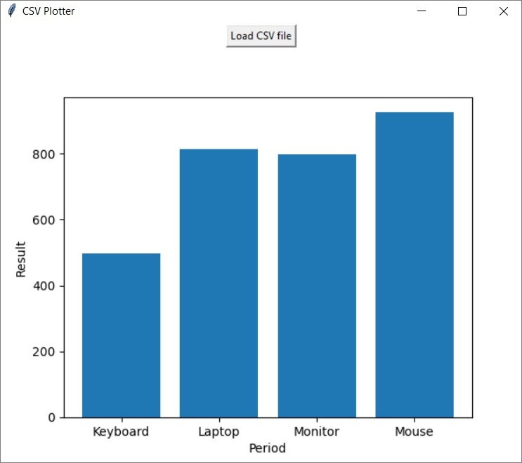

# CSV Plotter
 
This is a program that loads a CSV file and plots it on a bar chart.

The program works with column names and sums the values in the second column that have the same values in the first.

